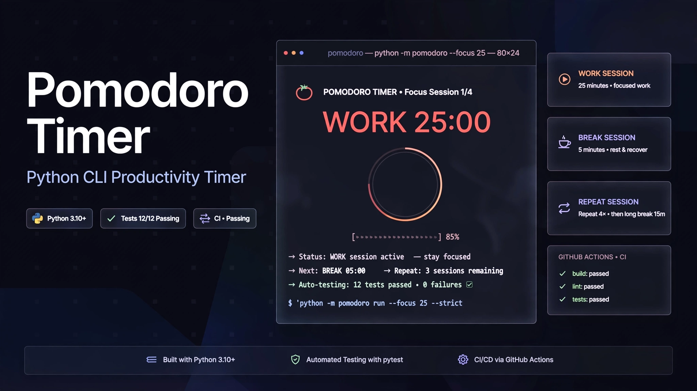

  

<h1 align="center">🍅 Pomodoro Timer</h1>

  A simple command-line Pomodoro Timer built with Python.

  
  
  

⸻

📌 Overview

Pomodoro Timer is a lightweight command-line application built with Python.

The project implements the basic Pomodoro workflow:

Work → Break → Repeat

It was created as a practical project for strengthening Python fundamentals while learning how to write automated tests and use GitHub Actions for continuous integration.

⸻

✨ Features

* ⏱️ Work timer
* ☕ Break timer
* 🔁 Start another Pomodoro session
* 🛑 Stop the timer
* 🧪 Automated tests with Pytest
* ⚙️ GitHub Actions CI
* 💻 Command-line interface

⸻

🍅 Pomodoro Workflow

The default session follows:

🍅 Work — 25 minutes
        ↓
☕ Break — 5 minutes
        ↓
🔁 Another session?
      ↙     ↘
    Yes       No
     ↓         ↓
   Work      Stop

⸻

🛠️ Technologies

Technology	Purpose
Python	Application logic
Pytest	Automated testing
GitHub Actions	Continuous Integration
time module	Countdown and timing

⸻

📂 Project Structure

Pomodoro-Timer/
│
├── assets/
│   └── pomodoro-banner.png
│
├── src/
│   └── pomodoro.py
│
├── tests/
│   └── test_pomodoro.py
│
├── .github/
│   └── workflows/
│       └── test.yml
│
├── requirements.txt
├── README.md
└── .gitignore

⸻

🚀 Getting Started

1. Clone the repository

git clone https://github.com/Yassir050/Pomodoro-Timer.git

2. Run the timer

python src/pomodoro.py

No external service or database is required.

⸻

⏱️ Default Timer

The application uses:

Session	Duration
🍅 Work	25 minutes
☕ Break	5 minutes

After the work and break sessions finish, the user can choose whether to start another Pomodoro.

⸻

🧪 Testing

The project uses Pytest for automated testing.

Install dependencies

pip install -r requirements.txt

Run tests

pytest

The test suite verifies the expected behavior of the timer functions.

⸻

⚙️ GitHub Actions

The project includes a GitHub Actions workflow for automated testing.

The workflow runs when:

* A push is made to main
* A pull request targets main
* The workflow is manually triggered

CI Pipeline

GitHub Repository
       ↓
Checkout Code
       ↓
Set up Python 3.12
       ↓
Install Dependencies
       ↓
Run Pytest
       ↓
   ✅ Tests Passed

This provides an introduction to Continuous Integration (CI) and automated project validation.

⸻

🧠 What I Learned

This project helped me practice:

* Python functions
* Function parameters and return values
* Loops
* Conditional statements
* User input
* Time handling
* while loops
* Automated testing
* Test assertions
* Pytest
* Project structure
* GitHub Actions
* Continuous Integration

⸻

🎯 Learning Goals

The main goal of this project is to move from basic Python syntax toward writing more structured and testable applications.

The project combines:

Python Fundamentals
        ↓
Functions
        ↓
Application Logic
        ↓
Testing
        ↓
Pytest
        ↓
GitHub Actions
        ↓
Continuous Integration

⸻

🔮 Future Improvements

Possible future improvements include:

* ⏸️ Pause and resume
* 🔄 Configurable work/break durations
* 🔔 Optional notifications
* 📊 Session statistics
* 🎯 Daily Pomodoro goals
* 💾 Session history
* 🖥️ Graphical user interface
* 🌐 Web version
* 📱 Mobile version

⸻

👨‍💻 Author

Yassir.B

Built as part of my Python development learning journey.

GitHub:

https://github.com/Yassir050

⸻

📄 License

This project is created for learning and portfolio purposes.

⸻

  🍅 Keep learning. Keep building. Keep improving.

